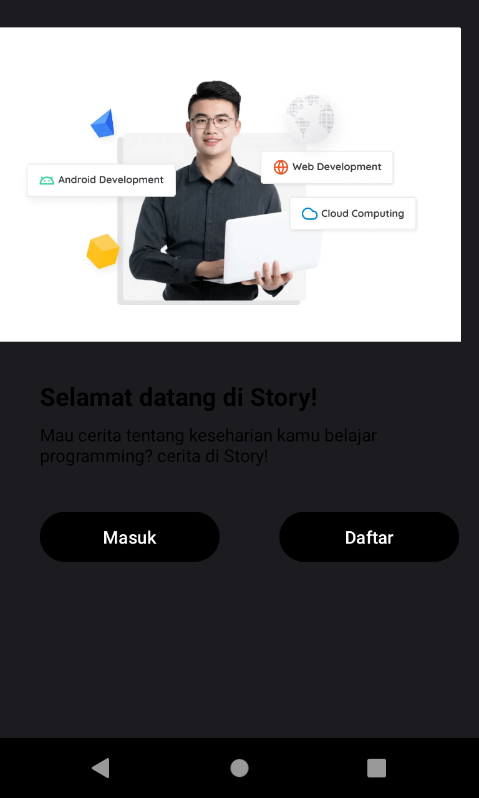
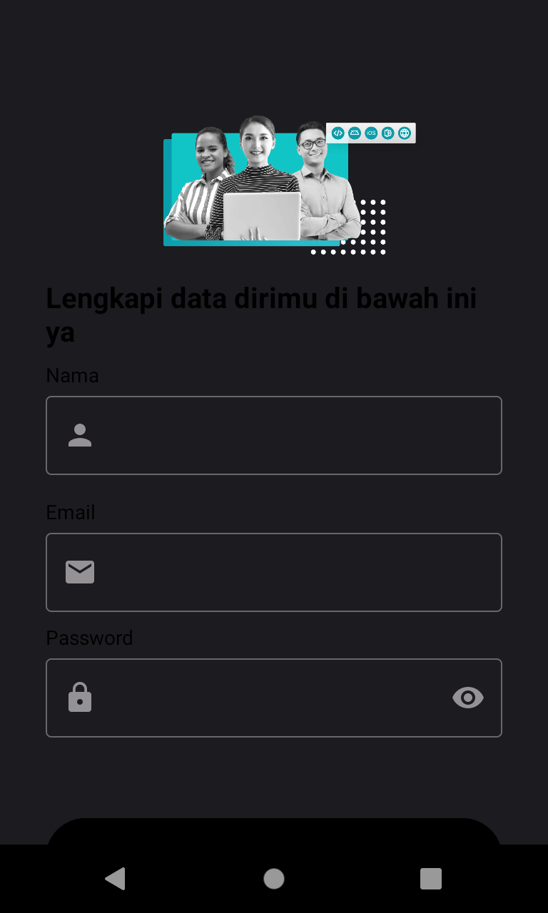
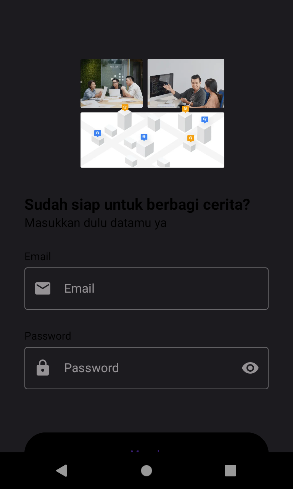
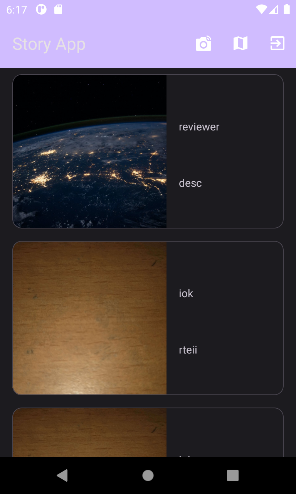
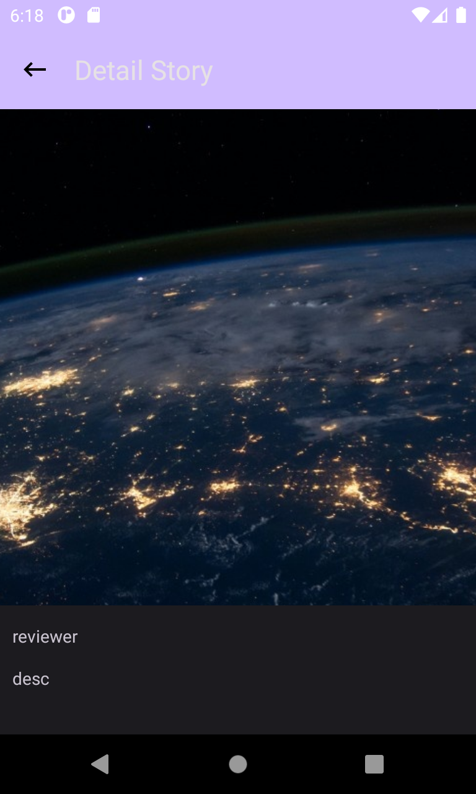
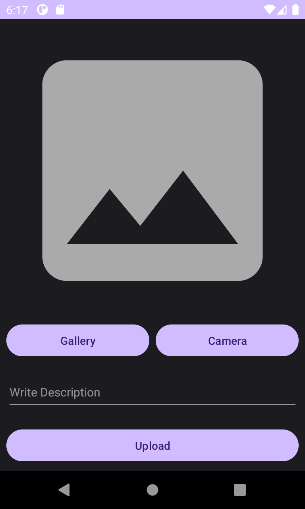
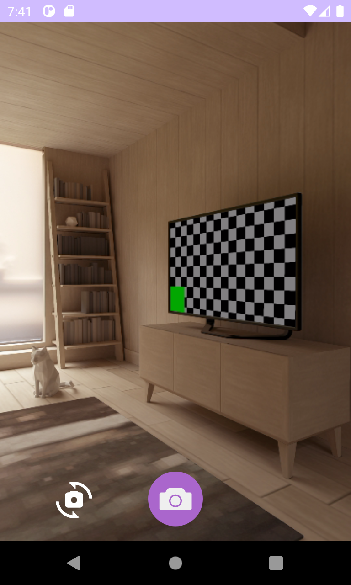

# Android MVVM Architecture - StoryApp

`MVVM Architecture` is one of the most popular architecture to develop an app. MVVM architectural pattern divides an application into three key components: Model, View, and ViewModel. Model: This is your business logic and data. Here, you process data, perform operations, and interact with data sources. View: This is the User Interface (UI). ViewModel: Acts as a mediator between the model and view.

## Prerequisites
Basic `Kotlin`, knowledge of `HTTP` request by Retrofit library are required for this project.

## Project Description
I build a Story Application with MVVM Architecture. There are 6 screen in this project, which first there are `landing screen` with 2 button `Masuk` and `Daftar` when you click `Daftar` you have to create an account to enter the applicaton, after that you will enter the `Masuk` screen that you have to log in with the account you just made, and after you click `Masuk` and then the application will create a token for you and store that in your device storage with `Shared Preference` so you dont have to re-login everytime you close the application, and after that you will enter the home screen which display the `Story` that other people post and will use `GET` method from retrofit library to getting the story from server. There are `Upload` button to upload story which use `POST` method from retrofit library to sending information to a server to add or update resource.

## Story API
I use [Dicoding Story API](https://story-api.dicoding.dev/v1/), because this project is for one of my course at [Bangkit Academy](https://www.dicoding.com/programs/bangkit).

## Libraries
* [Retrofit](https://github.com/square/retrofit) for HTTP Request
* [Glide](https://github.com/bumptech/glide) for Image Loader
* [Paging](https://developer.android.com/jetpack/androidx/releases/paging) for Display List Story Data
* [Mockito](https://github.com/mockito/mockito/releases) for Create Mock Object Testing
* [Ksp](https://github.com/google/ksp/releases) for Annotation Processors`

## Run Project
This Project was build on `JDK 1.8`. Sync the `Gradle` and run the project. Install APK on your emulator or real device. Dont forget to turn on the `internet` of your device so the application can access the API.

